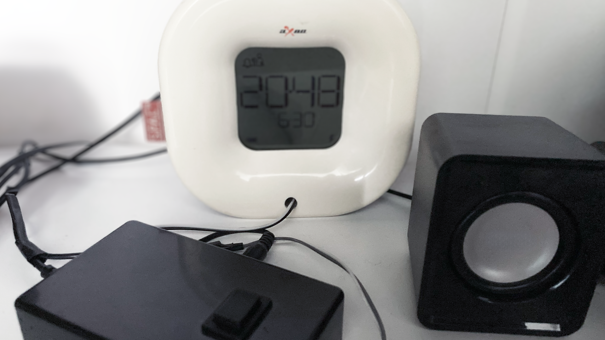

# wake-up

After many years of travelling and good sleep (even with Jetlag) thanks to [aXbo](https://www.axbo.at/pages/home) an Austrian sleep phase alarm clock,
I wanted to pimp my aXbo to use my own or preferred music as mp3.

> Note: aXbo recognizes when you're in deep sleep and wakes you up when the time is right; this product is one of the most important products I ever used, I don't know how I would have been able to handle not knowing in which country I will wake up and to any given time on earth, without my aXbo.

For the used serial MP3 board library see https://github.com/salvadorrueda/ArduinoSerialMP3Player by Salvador Rueda.

---

## How It Works

1. **Detecting sound at speaker output**: Using the analog input `A0` it will detect if the wake-up music started to play.
2. **Play MP3**: The MP3 board will get the command to play the music (external mini-speaker).
3. **Waiting for User-Input**: The music will repeat until a button on `D2` will be pushed.
4. **Optional open shutters**: A HTTP request can be send to FHEM to open the shutters

---

## Preparation

* Configure the MP3 board
* Opto-coupler and switch
* ESP8266 and connections
* Serial connection to MP3 board
* MP3 music filename `001` on microSD
* case, mini-speaker

---

## Programm on ESP8266

The flashing, testing, serial communication can all be done easily thanks to e.g. PlatformIO and Visual Studio Code intergration

---

## Legal Information

- This project uses PlatformIO, Visual Studio Code, NodeMCU, ArduinoSerialMP3Player, FHEM, etc. Refer to their respective licenses for compliance.
- Ensure your use case complies with data protection regulations, particularly when handling sensitive or personal information.
- The authors provide no warranty and assume no liability for any issues arising from the use of this tool.

---